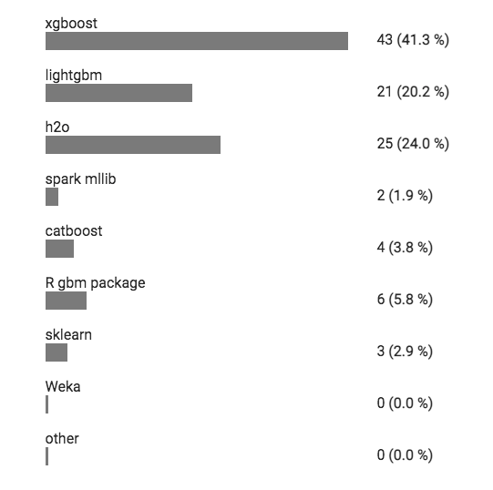
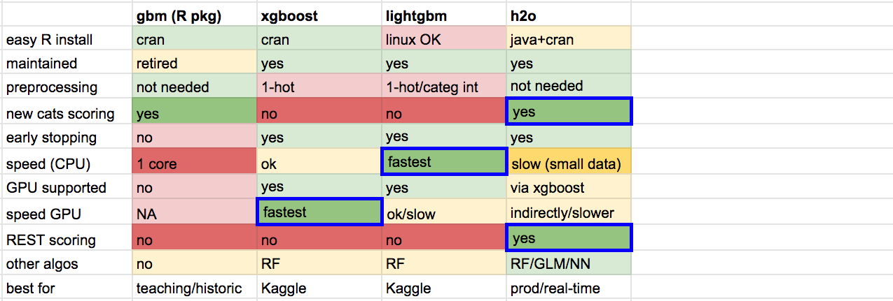

# GBM Performance

Performance of the top/most widely used open source GBM implementations (h2o, xgboost, lightgbm, catboost) 
on the airline dataset (100K, 1M and 10M records) and with `100` trees, depth `10`, learning rate `0.1`.


## Popularity of GBM implementations

Poll conducted via twitter (April, 2019):




## How to run/reproduce the benchmark

Installing to latest software versions and running/timing is easy and fully automated with docker: 

### CPU

(requires docker)

```
git clone https://github.com/szilard/GBM-perf.git
cd GBM-perf/cpu
sudo docker build --build-arg CACHE_DATE=$(date +%Y-%m-%d) -t gbmperf_cpu .
sudo docker run --rm gbmperf_cpu
```

### GPU

(requires docker, nvidia drivers and the `nvidia-docker` utility)

```
git clone https://github.com/szilard/GBM-perf.git
cd GBM-perf/gpu
sudo docker build -t gbmperf_gpu .
sudo nvidia-docker run --rm gbmperf_gpu
```


## Results

### CPU 

r4.8xlarge (32 cores, but run on physical cores only/no hyperthreading) with software as of 2019-04-29:

Tool         | Time[s] 100K | Time[s] 1M  |  Time[s] 10M  |   AUC 1M  |   AUC 10M
-------------|--------------|-------------|---------------|-----------|------------
h2o          |   16         |   20        |    100        |   0.762   |   0.776
xgboost      |   3.8        |   12        |     78        |   0.749   |   0.755
lightgbm     |   **2.4**    |    **5.2**  |     42        |   0.764   |   0.774
catboost     |   5.4        |   50        |    490        |   0.740   |   0.744 


### GPU

p3.2xlarge (1 GPU, Tesla V100) with software as of 2019-04-29:

Tool            | Time[s] 100K | Time[s] 1M  |  Time[s] 10M  |   AUC 1M  |   AUC 10M
----------------|--------------|-------------|---------------|-----------|------------
h2o xgboost     |   9          |    14       |     60        |   0.749   |   0.756  
xgboost         | **2.4**      |  **4.8**    |   **13**      |   0.750   |   0.756
lightgbm        |   10         |    16       |     67        |   0.766   |   0.774
catboost        |   3.9        |    10       |    135        |   0.742   |   0.750 


## Additional results 

Some additional studies obtained "manually" (not fully automated with docker as the main benchmark above).
Thanks [@Laurae2](https://github.com/Laurae2) for lots of help with some if these. 

### Faster CPUs

AWS has now better CPUs than r4.8xlarge (Xeon E5-2686 v4 2.30GHz, 32 cores), for example with higher CPU frequency 
c5.9xlarge (Xeon Platinum 8124M 3.00GHz, 36 cores) or more number of cores 
m5.12xlarge (Xeon Platinum 8175M 2.50GHz, 48 cores).

c5 and m5 are typically 20-50% faster than r4, for larger data more cores (m5) is the best, 
for smaller data high-frequency CPU (c5) is the best. Nevertheless, *the ranking of libs by
training time stays the same* for a given data size when changing CPU. More details
[here](https://github.com/szilard/GBM-perf/issues/13).

### Multi-socket CPUs

Most high-end servers have nowadays more than 1 CPU on the motherboard. For example c5.18xlarge has 2 CPUs
(2x of the c5.9xlarge CPUs mentioned above), same for r4.16xlarge or m5.24xlarge. There are even EC2 instances with 
4 CPUs e.g. x1.32xlarge (128 cores) or more.

One would think more CPU cores means higher training speed, though because of RAM topology and NUMA, **most of the above tools
run slower on 2 CPUs than 1 CPU!!** (with the exception of h2o for large data). The slowdown might be pretty 
dramatic, e.g. 2x for lightgbm or 3-5x for xgboost for the larger data in this benchmark. If you don't know about this, 
you will pay more money for a larger instance and get actually much slower training. More details
[here](https://github.com/szilard/GBM-perf/issues/13) and 
[here](https://github.com/szilard/GBM-multicore).

### RAM usage

...

### GPU utilization patterns

...

### 100M records

...

### Multiple GPUs

...


## Recommendations

If you **don't have a GPU, lightgbm** (CPU) trains the fastest.

If you **have a GPU, xgboost** (GPU) is also very fast (and depending on the data, your hardware etc.
often faster than the above mentioned lightgbm on CPU).

If you consider deployment, **h2o has the best ways to deploy** as a real-time
(fast scoring) application.

Note, however, there are a lot more other criteria to consider when you choose which tool
to use.

More info in my eRum 2018 R conference talk 
(video recording [here](https://www.youtube.com/watch?v=DqS6EKjqBbY),
slides [here](https://speakerdeck.com/szilard/better-than-deep-learning-gradient-boosting-machines-gbm-in-r-erum-conference-budapest-may-2018)), 
and a summary comparison table here:




